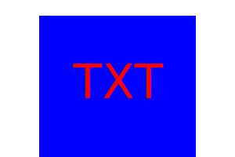
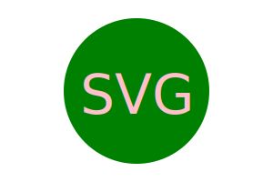
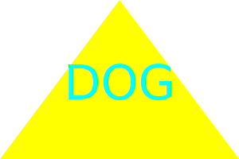

# SVG Logo Maker Challange

## What is the purpose?

The purpose of this challange was to create a command line application to build a SVG image by taking in user prompt inputs.

## How was it accomplished?

- The application gives the user prompts in the terminal.

#### The prompts are

    - Text (only accepts up to 3 characters)
    - Text Color (accepts color keyword or hexadecimal numbers)
    - A shape choice (gives the user a chocie between 3 shapes)
    - Shape color (accepts color keyword or hexadecimal numbers)

- The inputs are entered into a basic SVG template.  

- The `.svg` file is then created and displays the user created SVG logo.

## Example SVG

## Links

[Video]()

[GitHub Repo](https://github.com/Bryson987081/svg-logo-maker-challange)